Hey there, do you like what you see? Looks great right?

I would be explaining how you caould crete a personal blog that looks just like this and deploy using Netlify.

This project created using [Dan Abramov's Template](https://github.com/gaearon/overreacted.io).

Alright let's get to already.

First of all, you need to ensure you have the following things installed:

* NodeJS
* Gatsby CLI
* Yarn

Download and install the latest Node.js version from the [official Node.js website](https://nodejs.org/en/). When you install node, npm is also installed.

You can confirm your installation by running the command:
- npm --version
- node --version
If they're both install, this is what your response should look like.

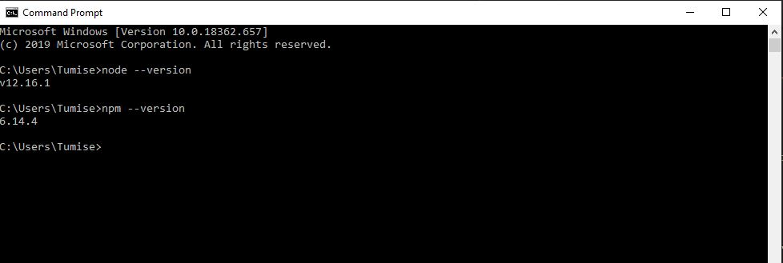

Now that that's done, let's go on and install Gatsby. The Gatsby CLI is available via npm and should be installed globally by running: `npm install -g gatsby-cli`

Note: when you install Gatsby and run it for the first time, you’ll see a short message notifying you about anonymous usage data that is being collected for Gatsby commands, you can read more about how that data is pulled out and used in the [telemetry doc](https://www.gatsbyjs.org/docs/telemetry).

Let's confirm our installation by running `gatsby --help` in our command prompt.

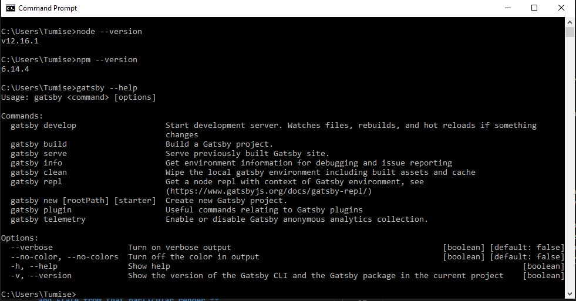

Lastly, let's install yarn by running `npm i -g yarn` in command.

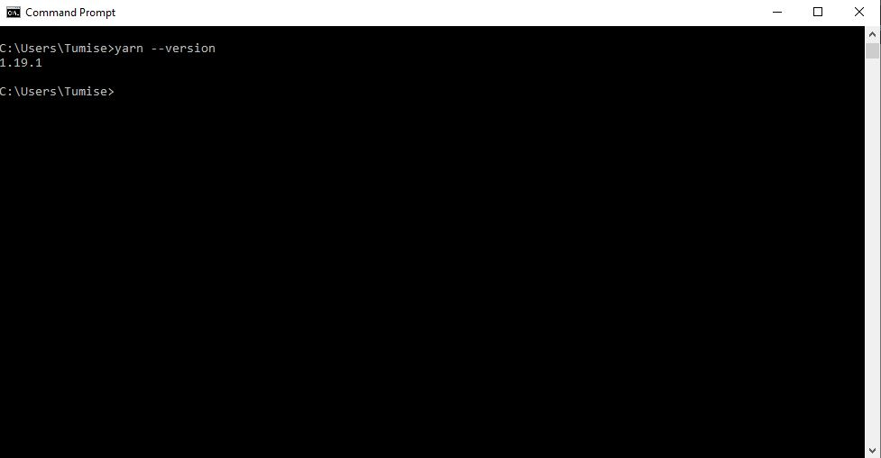

---

Now that we have all the necessary tools, lets go on to fork [the repo](https://www.github.com/blac-panda/codexplorer).

---

## Now that we've forked the repo, let's clone it. Simply run `git clone url-of-forked-repo` in git terminal.

This might take a minute. Now, lets install all the necessary packages. Open the cloned folder using VS Code or whatever editor is your favourite.

If you're using VS Code, simply press ctrl + ` to access the VS Code terminal.

Then run `yarn` to install all the packages, this might take a while.

Now that the packages have been successfully instaalled, let's test it to see if it works.

Run `yarn dev`, here's what a successful build looks like. To view it, check localhost:8000 

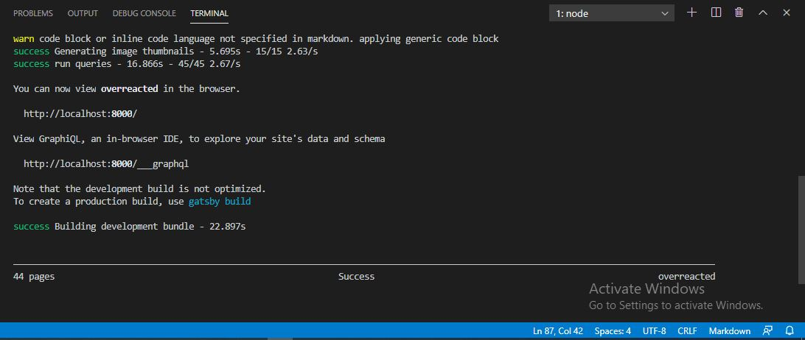

---

## Yay! It works. Now lets personalize your blog

---

First thing we should do, lets change the picture. Head over to `src/assets` and replace 'profile-pic.jpg' with your own picture, but make sure you rename it to 'profile-pic.jpg'.

Go to the components folder in `src/components` open up Bio.js. Here we have a couple of changes to make:

* Image alt name - line 16
* Blog intro and twitter link, line 25 - 30

Let's go on and edit links to the social media in `src/components/Footer.js`:

* Twitter link - line 20
* Github link - line 28
* LinkedIn link - line 36

To Edit site Metadata, go to gatsby-config.js

Lastly, lets head over to `src/templates/blog-post.js`, edits to be made:

* Line 20
* Line 21
* Line 139
* Line 212 (blog name)

To create your own posts, go to `src/pages`. For every post create a new folder, which will holder all the resources and contain the index.md (where the content of the post will be).
NB: You must have at least two post.

Now run `yarn dev` to views changes made.

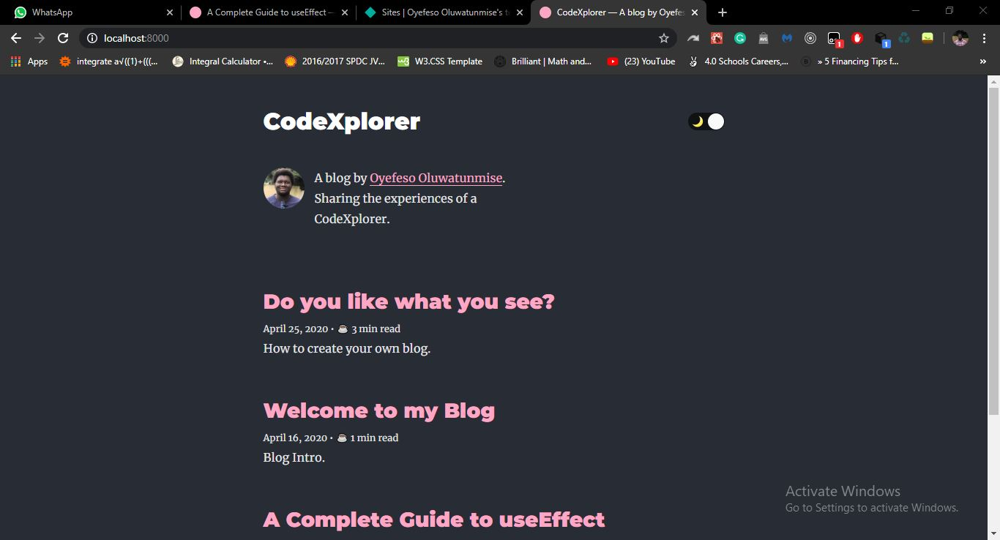

---

## Now let's deploy with Netlify

We will deploy with netlify by linking our github, so lets push the code there.

Open up your git terminal in the root of the project and run the following commands:

* `git add .`
* `git commit -m "put in a commit message within this quotation"`
* `git push origin master`

Great! Now the code is on our github. Navigate to [Netlify's website](https://www.netlify.com), log in. If you don't have an account create one.

Now Follow the following steps: 

* Click on new site from git
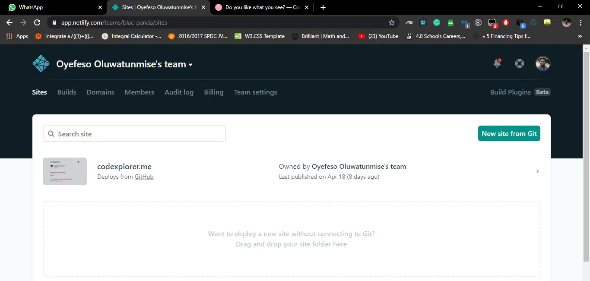

* Connect to a Git Provider of your choice, in our case, Github
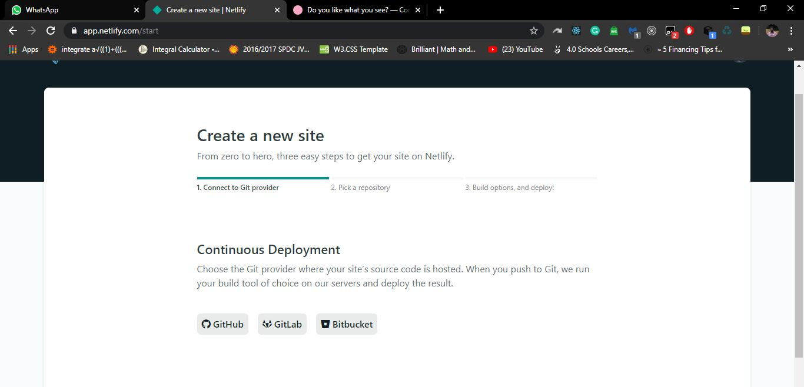

* Now, select the repo you wish to deploy
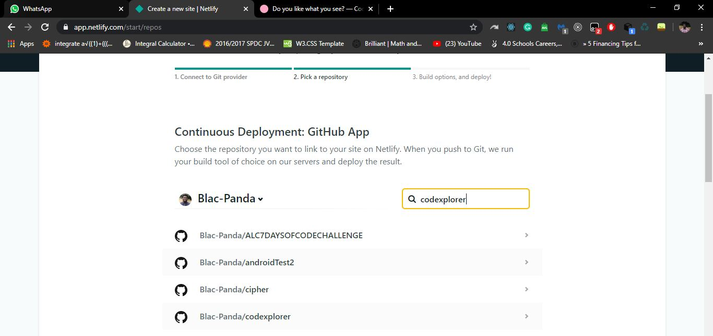

* Now click on deploy
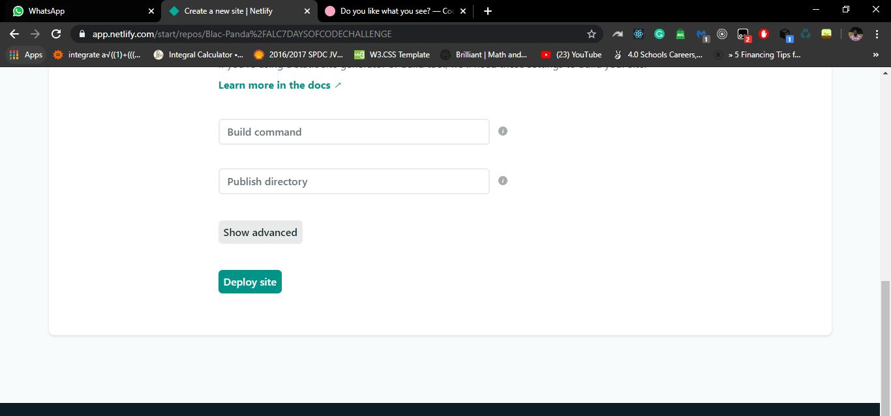

If your deployment fails, go to settings tab, view the sidebar and navigate to Environment, in Build & Deploy.
Select edit variable, to specify the Node version we want our environment to run, Key --> NODE_VERSION, value --> 12.16.1

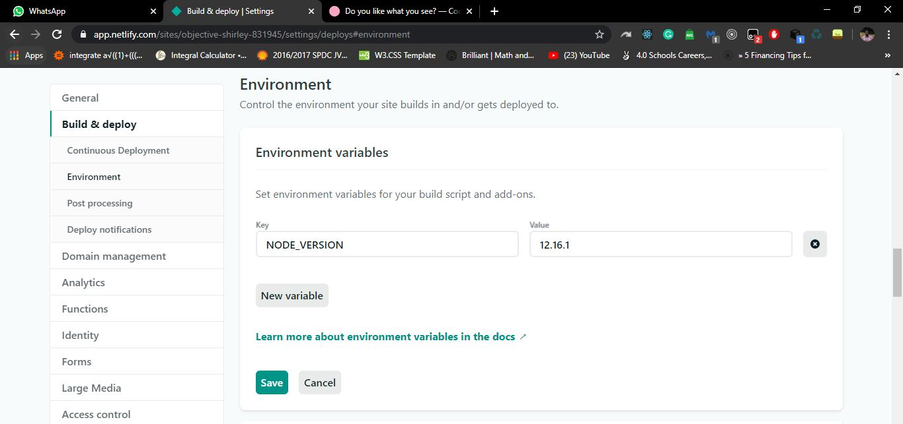

Now navigate to Deploy tab and trigger deploy.

NB: If you wish to purchase domain or add custom domain. Navigate to setting, then Domain management. Follow the simple steps.

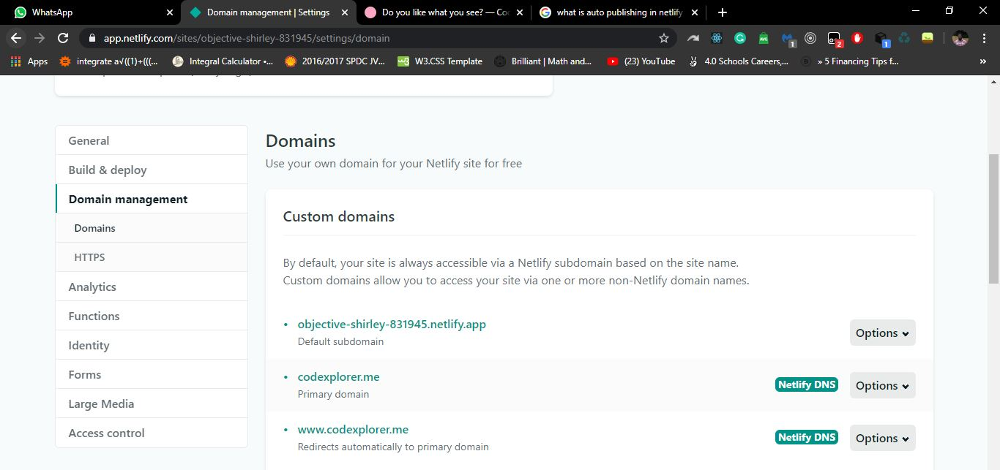

## Yay, you just deploy your blog, now go create great content !!!